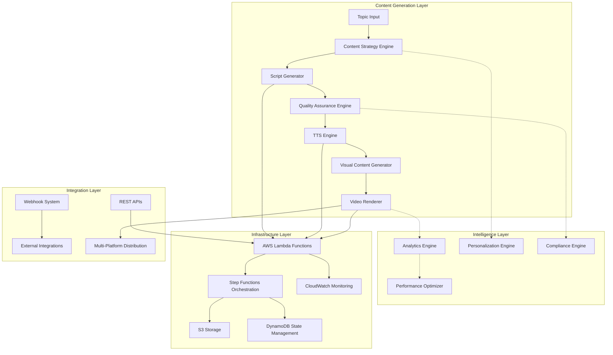
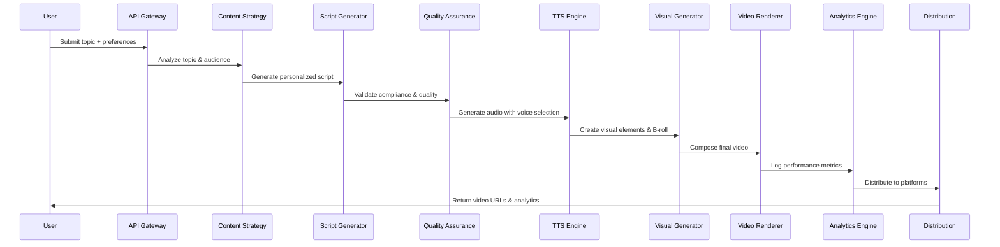

# Design Document

## Overview

This design document outlines the architecture and implementation approach for enhancing the YouTube Video Agents system based on the identified user story backlog. The design builds upon the existing AWS-based serverless architecture while introducing new capabilities for content quality, personalization, monitoring, and extensibility.

The enhanced system will maintain the current pipeline structure (Script Generation → TTS → B-roll → Rendering → Upload) while adding new layers for quality assurance, analytics, personalization, and multi-modal content support.

## Architecture

### High-Level Architecture



### Enhanced Pipeline Architecture



## Components and Interfaces

### 1. Content Strategy Engine

**Purpose:** Analyzes topics and audience preferences to guide content generation.

**Key Interfaces:**
```typescript
interface ContentStrategy {
  analyzeTopicRelevance(topic: string, region: string): TopicAnalysis;
  generateContentVariations(topic: string, audiences: Audience[]): ContentPlan[];
  suggestOptimizations(performanceData: PerformanceMetrics): Optimization[];
}

interface TopicAnalysis {
  relevanceScore: number;
  targetAudiences: string[];
  suggestedAngles: string[];
  competitiveContent: ContentReference[];
  seasonalFactors: SeasonalData;
}
```

**Implementation:**
- AWS Lambda function with Bedrock integration
- DynamoDB for topic history and performance tracking
- Integration with external market data APIs

### 2. Enhanced Script Generator

**Purpose:** Generates region-specific, audience-targeted scripts with multiple templates.

**Key Interfaces:**
```typescript
interface ScriptGenerator {
  generateScript(request: ScriptRequest): ScriptResponse;
  validateCompliance(script: string, region: string): ComplianceResult;
  optimizeForEngagement(script: string, metrics: EngagementData): string;
}

interface ScriptRequest {
  topic: string;
  targetRegions: string[];
  audienceLevel: 'beginner' | 'intermediate' | 'advanced';
  duration: number;
  template: ScriptTemplate;
}
```

**Implementation:**
- Enhanced Bedrock prompts with region-specific templates
- Compliance validation using rule-based engine
- A/B testing framework for script optimization

### 3. Quality Assurance Engine

**Purpose:** Automated content review for compliance, accuracy, and quality standards.

**Key Interfaces:**
```typescript
interface QualityAssurance {
  validateCompliance(content: Content): ComplianceReport;
  checkFactualAccuracy(script: string): AccuracyReport;
  assessEngagementPotential(content: Content): EngagementScore;
}

interface ComplianceReport {
  passed: boolean;
  violations: ComplianceViolation[];
  requiredDisclaimers: string[];
  regionSpecificIssues: RegionIssue[];
}
```

**Implementation:**
- Rule-based compliance engine with jurisdiction-specific rules
- Integration with financial data providers for fact-checking
- ML-based engagement prediction model

### 4. Multi-Modal Visual Generator

**Purpose:** Creates charts, graphs, and visual elements to enhance video content.

**Key Interfaces:**
```typescript
interface VisualGenerator {
  generateCharts(data: FinancialData, type: ChartType): ChartAsset;
  createInfographics(keyPoints: string[]): InfographicAsset;
  selectBrollFootage(script: string, duration: number): BrollSelection;
}

interface ChartAsset {
  s3Key: string;
  type: 'line' | 'bar' | 'pie' | 'candlestick';
  duration: number;
  animationConfig: AnimationSettings;
}
```

**Implementation:**
- Python-based chart generation using matplotlib/plotly
- Integration with financial data APIs (Alpha Vantage, Yahoo Finance)
- Automated B-roll selection using content analysis

### 5. Enhanced TTS Engine

**Purpose:** Provides natural, diverse voice synthesis with regional accents and emphasis.

**Key Interfaces:**
```typescript
interface TTSEngine {
  synthesizeWithEmphasis(script: AnnotatedScript): AudioAsset;
  selectOptimalVoice(audience: Audience, region: string): VoiceConfig;
  addBackgroundMusic(audio: AudioAsset, mood: string): AudioAsset;
}

interface AnnotatedScript {
  text: string;
  emphasisMarkers: EmphasisMarker[];
  pausePoints: PausePoint[];
  voiceDirections: VoiceDirection[];
}
```

**Implementation:**
- Enhanced Polly integration with SSML markup
- Voice selection algorithm based on audience demographics
- Background music library with automatic mixing

### 6. Analytics and Performance Engine

**Purpose:** Tracks content performance and provides optimization insights.

**Key Interfaces:**
```typescript
interface AnalyticsEngine {
  trackVideoPerformance(videoId: string): PerformanceMetrics;
  generateInsights(timeRange: DateRange): AnalyticsInsights;
  predictPerformance(content: Content): PerformancePrediction;
}

interface PerformanceMetrics {
  views: number;
  engagement: EngagementMetrics;
  retention: RetentionCurve;
  demographics: AudienceDemographics;
  conversionMetrics: ConversionData;
}
```

**Implementation:**
- YouTube Analytics API integration
- Real-time metrics collection via CloudWatch
- ML-based performance prediction models

### 7. Cost Optimization Manager

**Purpose:** Monitors and optimizes AWS resource usage and costs.

**Key Interfaces:**
```typescript
interface CostOptimizer {
  analyzeResourceUsage(): ResourceAnalysis;
  optimizeWorkflowCosts(workflow: WorkflowDefinition): OptimizationPlan;
  predictMonthlyCosts(usage: UsageProjection): CostForecast;
}

interface ResourceAnalysis {
  lambdaUsage: LambdaMetrics;
  storageUsage: StorageMetrics;
  bedrockUsage: BedrockMetrics;
  recommendations: CostRecommendation[];
}
```

**Implementation:**
- AWS Cost Explorer API integration
- Automated resource scaling based on demand
- Cost alerting and budget management

## Data Models

### Core Content Models

```typescript
// Enhanced Job Model
interface VideoJob {
  jobId: string;
  status: JobStatus;
  topic: string;
  targetRegions: string[];
  audienceProfile: AudienceProfile;
  contentStrategy: ContentStrategy;
  generatedAssets: GeneratedAssets;
  performanceMetrics: PerformanceMetrics;
  createdAt: Date;
  updatedAt: Date;
}

// Audience Profiling
interface AudienceProfile {
  experienceLevel: 'beginner' | 'intermediate' | 'advanced';
  primaryRegion: string;
  demographics: Demographics;
  preferences: ContentPreferences;
  engagementHistory: EngagementHistory;
}

// Content Assets
interface GeneratedAssets {
  script: ScriptAsset;
  audio: AudioAsset;
  visuals: VisualAsset[];
  video: VideoAsset;
  metadata: ContentMetadata;
}

// Performance Tracking
interface PerformanceMetrics {
  platformMetrics: PlatformMetrics[];
  engagementScores: EngagementScores;
  audienceRetention: RetentionData;
  conversionMetrics: ConversionMetrics;
}
```

### Configuration Models

```typescript
// Regional Configuration
interface RegionalConfig {
  region: string;
  currency: string;
  taxRegulations: TaxRule[];
  complianceRequirements: ComplianceRule[];
  marketData: MarketDataConfig;
  voicePreferences: VoiceConfig;
}

// Template System
interface ContentTemplate {
  templateId: string;
  name: string;
  targetAudience: string;
  structure: TemplateStructure;
  complianceRules: string[];
  examples: TemplateExample[];
}
```

## Error Handling

### Comprehensive Error Management Strategy

1. **Graceful Degradation**
   - Fallback to simpler content generation if advanced features fail
   - Default voice/visual options when personalization fails
   - Basic compliance checking if advanced validation unavailable

2. **Retry Mechanisms**
   - Exponential backoff for API calls
   - Circuit breaker pattern for external services
   - Dead letter queues for failed jobs

3. **Error Classification**
   ```typescript
   enum ErrorType {
     TRANSIENT = 'transient',      // Retry automatically
     CONFIGURATION = 'config',      // Requires admin intervention
     CONTENT = 'content',          // Requires content review
     COMPLIANCE = 'compliance',    // Requires legal review
     RESOURCE = 'resource'         // Requires scaling/optimization
   }
   ```

4. **Monitoring and Alerting**
   - Real-time error tracking via CloudWatch
   - Automated escalation for critical failures
   - Performance degradation alerts

## Testing Strategy

### Multi-Layer Testing Approach

1. **Unit Testing**
   - Individual component testing for all Lambda functions
   - Mock external API dependencies
   - Compliance rule validation testing
   - Content generation algorithm testing

2. **Integration Testing**
   - End-to-end pipeline testing with sample content
   - Cross-service communication validation
   - External API integration testing
   - Performance benchmarking

3. **Content Quality Testing**
   - Automated script quality assessment
   - A/B testing framework for content variations
   - Compliance validation testing across regions
   - Performance prediction model validation

4. **Load and Performance Testing**
   - Concurrent job processing testing
   - Resource scaling validation
   - Cost optimization verification
   - Failure recovery testing

5. **User Acceptance Testing**
   - Content creator workflow validation
   - Analytics dashboard usability testing
   - Multi-platform distribution verification
   - Regional content accuracy validation

### Testing Infrastructure

```typescript
// Test Configuration
interface TestConfig {
  environment: 'dev' | 'staging' | 'prod';
  testDataSets: TestDataSet[];
  mockServices: MockServiceConfig[];
  performanceThresholds: PerformanceThreshold[];
}

// Automated Test Suites
interface TestSuite {
  name: string;
  type: 'unit' | 'integration' | 'e2e' | 'performance';
  tests: TestCase[];
  schedule: TestSchedule;
  notifications: NotificationConfig;
}
```

### Continuous Testing Pipeline

1. **Pre-deployment Testing**
   - Automated unit and integration tests on every commit
   - Content quality validation for new templates
   - Performance regression testing

2. **Post-deployment Validation**
   - Smoke tests for critical functionality
   - Content generation validation
   - Performance monitoring

3. **Ongoing Quality Assurance**
   - Daily content quality audits
   - Weekly performance reviews
   - Monthly compliance assessments

This design provides a comprehensive foundation for implementing the user story backlog while maintaining the existing system's reliability and extending its capabilities for enhanced content creation, quality assurance, and performance optimization.